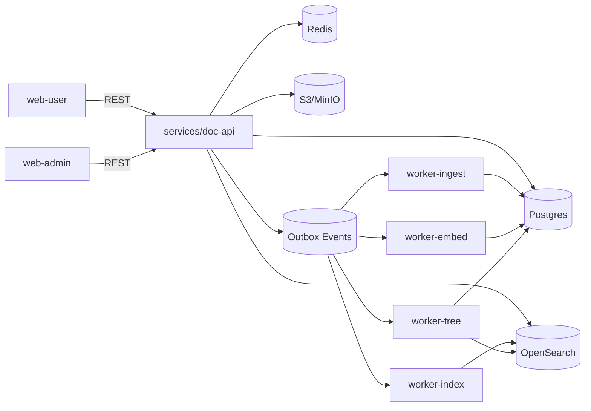

# ARCHITECTURE.md — AutoDoc Tree (Monorepo)

## 1) Overview
AutoDoc Tree is a multi-tenant (Workspace=Tenant) document platform that:
- ingests editor text and uploaded files
- indexes for search (BM25 + optional vector/hybrid)
- builds an explainable, stable 2-depth virtual tree (snapshots)
- learns from user feedback (move/rename) over time

## 2) Repo layout (target)
```txt
.
├── services/            # Kotlin + Spring Boot (Gradle multi-module)
│   ├── doc-api/
│   ├── worker-ingest/
│   ├── worker-embed/
│   ├── worker-index/
│   ├── worker-tree/
│   └── libs/
│       ├── common/
│       └── contracts/
├── web-user/            # Vite + React + TS (port 5174)
├── web-admin/           # Vite + React + TS (port 5173)
├── docker-compose.yml
└── tasks/backlog/...
```

## 3) High-level components


## 4) Multi-tenancy model (Workspace = Tenant)
Shared infra with strict scoping:
- API: WorkspaceContext (workspace_id + role) mandatory
- DB: every tenant table includes workspace_id; repository wrappers enforce scope
- OpenSearch: `TenantSearchClient` injects term filter `workspace_id=...` (non-removable)
- Redis: key prefix `ws:{workspace_id}:...`
- S3: key prefix `workspaces/{workspace_id}/...`; presign requires ownership check

Security policy: **fail closed** (deny on any tenant uncertainty).

## 5) Data flow

### 5.1 Editor save
1) web-user saves markdown → `POST /documents`
2) doc-api writes document row (READY) and emits Outbox `DocumentSaved`
3) workers process:
   - embed → index → tree (ingest stage may be skipped if no attachments)

### 5.2 File upload
1) web-user requests presign → `POST /attachments/presign`
2) Upload to MinIO/S3
3) Complete → `POST /attachments/complete`
4) Outbox `AttachmentUploaded` → ingest extracts text/sections → downstream

### 5.3 Tree build
Per workspace:
- neighbor graph (TopK similar docs, tenant-filtered)
- clustering (2-depth) + labeling
- snapshot persisted (ACTIVE or RECOMMENDED)
- membership rationale stored

## 6) Reliability
- Outbox at-least-once
- Workers: retry/backoff + DLQ
- Stage idempotency key: (workspace_id, document_id, stage, input_hash, model_version)
- Rebuild debounce/coalesce to avoid thrashing

## 7) Explainability
Explain endpoint returns:
- keywords(top5)
- similar docs(top3)
- signals(enum list)
Always returns schema; missing data yields empty fields.

## 8) Ops
- Admin job console: stage status + retries
- Audit log for sensitive actions
- Runbooks: reindex, rebuild, reprocess, incident response
