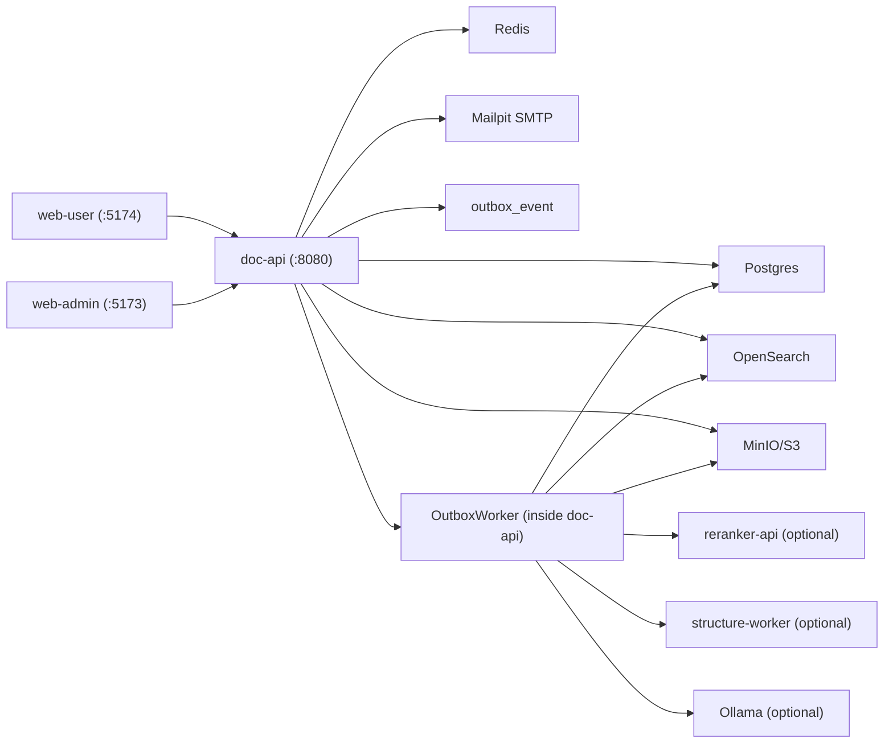
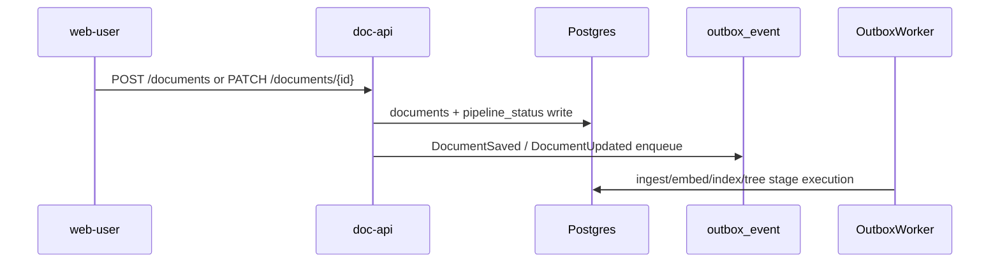
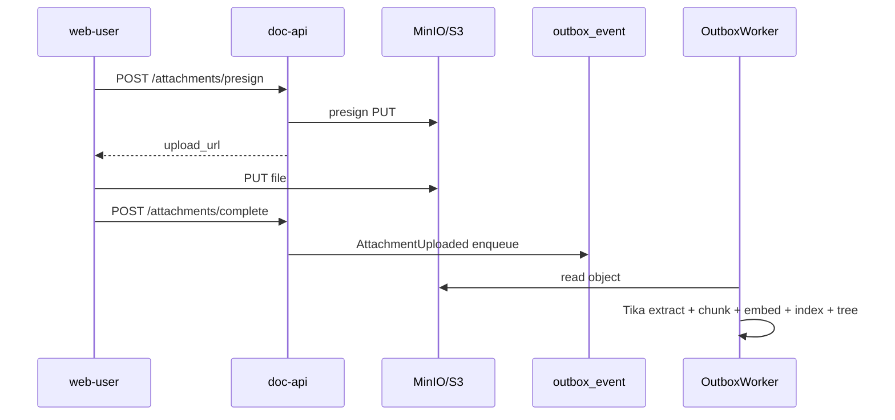

# AutoDoc Tree Technical Handbook

이 문서는 현재 코드 기준으로 AutoDoc Tree 전체를 빠르게 이해하기 위한 통합 기술문서다. 설정 문서, API 초안, 런북은 이미 존재하지만, 여기서는 "이 저장소가 지금 실제로 어떻게 동작하는가"를 기준으로 시스템을 한 번에 설명한다.

## 1. 프로젝트 한 줄 요약

AutoDoc Tree는 `Workspace = Tenant`를 기본 격리 단위로 삼는 문서 정리 서비스다.

- 사용자는 문서를 직접 구조화하기보다 저장/업로드만 수행한다.
- 서버는 비동기 파이프라인으로 텍스트를 추출하고, 임베딩과 인덱스를 만들고, 설명 가능한 가상 트리 스냅샷을 생성한다.
- 사용자의 move/rename 피드백, 규칙, 질문 응답이 다음 트리 재구성에 반영된다.
- 기본 정책은 "tenant-safe", "non-destructive", "explainable", "stable-by-default"이다.

## 2. 저장소 맵

```text
.
├── services/
│   ├── doc-api/            # 현재 핵심 백엔드. REST API + scheduled outbox worker 포함
│   ├── worker-ingest/      # Gradle 모듈만 존재, 현재 소스 없음
│   ├── worker-embed/       # Gradle 모듈만 존재, 현재 소스 없음
│   ├── worker-index/       # Gradle 모듈만 존재, 현재 소스 없음
│   ├── worker-tree/        # Gradle 모듈만 존재, 현재 소스 없음
│   ├── reranker-api/       # 선택형 로컬 Python reranker
│   ├── structure-worker/   # 선택형 로컬 Python structure worker
│   └── libs/common/        # 공용 enum(Role/Stage/StageStatus)
├── web-user/               # 사용자 앱 (React + Vite + TipTap editor)
├── web-admin/              # 운영/디버그 앱 (React + Vite)
├── packages/api-client/    # 공용 TS API client
├── docs/                   # setup/runbook/telemetry/dashboard 문서
├── infra/observability/    # Prometheus/Grafana 로컬 관측성 설정
├── scripts/                # seed, smoke, OpenSearch, model manifest 스크립트
├── models/                 # 오프라인 모델 manifest
└── tasks/                  # 티켓 기반 개발 기록
```

핵심 포인트:

- 현재 실질적인 비즈니스 로직은 거의 모두 `services/doc-api` 안에 있다.
- `worker-*` 모듈은 모노레포 구조상 예약되어 있지만, 현재 워커 실행은 `doc-api` 내부 `OutboxWorker`가 담당한다.
- 프론트엔드는 `web-user`, `web-admin` 두 앱으로 분리되며 둘 다 `packages/api-client`를 공용 사용한다.

## 3. 런타임 토폴로지

### 3.1 현재 로컬 실행 구성



### 3.2 보조 런타임

- `Ollama`: 임베딩과 LLM 라벨/설명 생성용 선택형 런타임
- `reranker-api`: Tree Stage-B edge validation
- `structure-worker`: 구조 추론 fallback/hSBM 경로
- `Prometheus`/`Grafana`: 로컬 계측 대시보드

## 4. 기술 스택

### 4.1 백엔드

- Kotlin 2.0
- Spring Boot 3.4
- Spring Security
- Spring JDBC
- Flyway
- Redis client
- Micrometer + Prometheus registry
- AWS SDK v2 for S3 presign/get
- Apache Tika for text extraction

### 4.2 프론트엔드

- React 18
- Vite 6
- React Router 6
- TypeScript 5.7
- TipTap 3 (`web-user` block editor)
- Playwright E2E

### 4.3 인프라/서드파티

- Postgres 16
- OpenSearch 2.13
- Redis 7
- MinIO
- Mailpit
- Ollama
- Python FastAPI/uvicorn 기반 선택형 ML 서비스

## 5. 백엔드 구조

### 5.1 엔트리 포인트

`services/doc-api`는 현재 사실상 단일 백엔드 애플리케이션이다.

- REST 컨트롤러: [`services/doc-api/src/main/kotlin/com/autodoctree/api/controller/ApiControllers.kt`](../services/doc-api/src/main/kotlin/com/autodoctree/api/controller/ApiControllers.kt)
- 설정 바인딩: [`services/doc-api/src/main/kotlin/com/autodoctree/api/config/AppConfig.kt`](../services/doc-api/src/main/kotlin/com/autodoctree/api/config/AppConfig.kt)
- 보안 체인: [`services/doc-api/src/main/kotlin/com/autodoctree/api/config/SecurityConfig.kt`](../services/doc-api/src/main/kotlin/com/autodoctree/api/config/SecurityConfig.kt)
- 워커: [`services/doc-api/src/main/kotlin/com/autodoctree/api/worker/OutboxWorker.kt`](../services/doc-api/src/main/kotlin/com/autodoctree/api/worker/OutboxWorker.kt)
- 저장소: [`services/doc-api/src/main/kotlin/com/autodoctree/api/db/Repositories.kt`](../services/doc-api/src/main/kotlin/com/autodoctree/api/db/Repositories.kt)

### 5.2 주요 서비스 경계

#### Auth / Workspace

파일: `AuthWorkspaceServices.kt`

- `AuthService`
  - 회원가입 인증코드 발송
  - 코드 검증 후 사용자/기본 워크스페이스 생성
  - 로그인
  - refresh token rotation
  - logout
- `WorkspaceService`
  - 워크스페이스 생성
  - 멤버 목록/추가/역할변경/제거
  - 초대 토큰 생성/수락

특징:

- 회원가입은 Mailpit 기반 이메일 인증을 전제로 한다.
- 워크스페이스 초대는 이메일 바인딩 검사를 수행한다.
- 서버는 항상 membership을 확인해 role을 결정한다.

#### Document / Attachment / Search

파일: `DocumentServices.kt`

- `DocumentService`
  - 문서 생성/조회/수정/삭제/복구
  - sidebar/library/trash/favorites/personal top
  - 문서 계층(`parent_document_id`) 관리
  - 파이프라인 stage retry
- `AttachmentService`
  - presign URL 발급
  - 업로드 완료 처리
  - S3 key namespace 검증
- `SearchService`
  - 검색/검색 히스토리 처리

주의:

- 검색 인덱스 동기화용 `TenantSearchClient`와 OpenSearch 코드는 존재한다.
- 하지만 현재 `/api/v1/search` 경로는 `SearchDocumentRepository` 기반의 JDBC 검색을 사용한다.
- 즉, OpenSearch 업서트/삭제 인프라는 현재 코드에 존재하지만, 검색 API의 주 실행 경로는 아직 SQL 검색이다.

#### Tree / Feedback / Admin / Questions

파일: `TreeFeedbackAdminServices.kt`, `QuestionService.kt`

- `TreeService`
  - 워크스페이스 트리 리빌드
  - active tree 조회
  - snapshot 조회/활성화
  - rebuild queue 상태 조회
  - explain payload 반환/accept
  - debug view 데이터 생성
- `FeedbackService`
  - 문서 move
  - 노드 rename
  - 피드백 이벤트 기록 + outbox enqueue
- `AdminService`
  - 잡 목록/재시도
  - audit 조회
  - debug endpoints
  - tree policy override
  - user rules CRUD/preview
- `QuestionService`
  - active learning question 생성/조회/응답/만료

## 6. 멀티테넌시와 보안 계약

이 프로젝트에서 가장 중요한 계약은 `Workspace = Tenant`다.

### 6.1 요청 단위 격리

흐름:

1. `AuthFilter`가 JWT를 검증한다.
2. `WorkspaceContextFilter`가 `X-Workspace-Id`를 강제한다.
3. `memberships` 테이블로 `(user_id, workspace_id)` membership을 검증한다.
4. 성공 시 `WorkspaceContext(userId, workspaceId, role)`를 request attribute에 넣는다.
5. 각 서비스는 `WorkspaceContextResolver`로 이 컨텍스트를 가져와 처리한다.

관련 파일:

- `security/AuthFilter.kt`
- `tenant/WorkspaceContextFilter.kt`
- `tenant/WorkspaceContextResolver.kt`
- `tenant/WorkspaceContext.kt`

보안 성질:

- 헤더가 없으면 `400`
- 멤버십이 없으면 `403`
- 테넌트 불확실성은 fail-closed
- MDC에 `workspace_id`, `trace_id`, `request_id`를 주입

### 6.2 저장소/스토리지 격리

- DB: 거의 모든 tenant 자원은 `workspace_id` 조건을 포함한다.
- OpenSearch: `TenantSearchClient`가 `workspace_id` term filter를 강제한다.
- S3: object key는 반드시 `workspaces/{workspace_id}/...` prefix를 가져야 한다.
- 로그: 본문/청크/벡터/첨부 내용은 redact 또는 truncate된다.

관련 파일:

- `search/TenantSearchClient.kt`
- `storage/S3StorageService.kt`
- `infra/LogSanitizer.kt`
- `db/TenantRepositoryGuardrailTest.kt`
- `integration/TenantIsolationIntegrationTest.kt`
- `integration/TenantScopeEnforcementIntegrationTest.kt`

## 7. 데이터 모델

### 7.1 핵심 엔티티 그룹

`Repositories.kt` 기준 주요 저장소는 아래와 같이 묶인다.

#### 계정/권한

- `users`
- `refresh_tokens`
- `workspaces`
- `memberships`
- `workspace_invites`
- `registration_verification_codes`

#### 문서/업로드

- `documents`
- `attachments`
- `document_sections`
- `pipeline_status`
- `document_favorite`
- `document_personal_top`
- `document_acl`

#### 비동기 처리

- `outbox_event`
- `dlq_event`
- `stage_execution`

#### 트리/피드백/품질

- `tree_snapshot`
- `tree_node`
- `tree_membership`
- `feedback_event`
- `user_rule`
- `workspace_tree_policy`
- `workspace_question_control`
- `active_learning_question`
- `concept_prototype`

#### 운영/탐색

- `audit_log`
- `palette_history`
- `embeddings`

### 7.2 마이그레이션 히스토리

Flyway migration은 `V1`부터 `V17`까지 존재한다.

- `V1`: baseline schema
- `V2`: snapshot node rename count
- `V3`: embedding input hash cache
- `V4`: user rule table
- `V5`: tree snapshot label cache
- `V6`: workspace tree policy
- `V7`: user rule effect update
- `V8`: active learning queue
- `V9`: concept prototype store
- `V10`: tree view partition
- `V11`: document template signals
- `V12`: document parent hierarchy
- `V13`: document favorites
- `V14`: search palette, ACL, invites
- `V15`: `blocks_json`
- `V16`: personal top pages
- `V17`: auth registration verification codes

## 8. 핵심 데이터 흐름

### 8.1 문서 생성/수정



구현 포인트:

- 문서 수정은 optimistic locking(`version`)을 사용한다.
- `blocks_json` 저장 시 서버가 `body_markdown`, `body_text`를 동기화한다.
- 복구 시에는 `DocumentSaved(restored=true)` 이벤트를 다시 넣는다.

### 8.2 첨부 업로드



보안 포인트:

- presign 전 문서 ownership과 workspace scope를 확인한다.
- complete 시 object key prefix를 재검증한다.

### 8.3 파이프라인 단계

현재 stage enum은 `INGEST`, `EMBED`, `INDEX`, `TREE` 4단계다.

#### INGEST

- 첨부가 있으면 S3에서 읽고 Tika로 텍스트를 추출한다.
- 첨부가 없으면 `body_markdown`을 사용한다.
- `SectionChunker`로 섹션/청크를 만든다.

#### EMBED

- `EmbeddingInputPreprocessor`가 입력을 정규화한다.
- `EmbeddingQualityScorer`가 품질 신호를 계산한다.
- `EmbeddingProvider`가 stub 또는 Ollama를 통해 임베딩을 만든다.
- 채널별 임베딩(TITLE/BODY_SUMMARY/SECTION/SECTION_CENTROID/DOCUMENT)을 저장한다.

#### INDEX

- `TenantSearchClient.upsert/delete`가 인덱스 동기화를 담당한다.
- 현재 코드상 인덱스 동기화는 OpenSearch까지 지원하지만 검색 API 경로는 별도로 JDBC 검색을 사용한다.

#### TREE

- debounce queue를 거쳐 리빌드를 실행한다.
- neighbor graph, clustering, labeling, snapshot persistence, rationale 저장까지 수행한다.

### 8.4 Stage reliability

신뢰성 장치는 아래와 같다.

- outbox at-least-once
- retry/backoff/DLQ
- stage execution idempotency key
- pipeline status registry
- debounce/coalesce rebuild queue

관련 파일:

- `worker/OutboxWorker.kt`
- `domain/RebuildDebounceQueue.kt`
- `db/StageExecutionRepository`
- `db/OutboxRepository`

## 9. 트리 생성 서브시스템

트리 생성은 이 프로젝트의 핵심 알고리즘 영역이다.

### 9.1 입력

- 문서 메타데이터
- 채널별 임베딩
- 섹션 텍스트
- 사용자 피드백(move/rename)
- user rules
- template 신호
- workspace override policy

### 9.2 주요 처리 단계

1. 임베딩 집계
2. neighbor graph 생성
3. edge filtering
4. clustering
5. labeling
6. assignment policy(auto/recommend/unsorted)
7. optional concept preassign / optimizer / structure worker path
8. snapshot 저장
9. rationale 저장

### 9.3 neighbor graph

`TreeAlgorithms.kt`의 `NeighborBuilder`가 담당한다.

주요 파라미터:

- `neighborTopK`
- `neighborMinSimilarity`
- `neighborNormalize`
- `neighborMutualKnn`
- `neighborSharedNeighborJaccardMin`
- `neighborEdgeBudget`
- `neighborDegreeCap`
- `fusionSemanticWeight`
- `fusionLexicalWeight`
- `fusionLexicalGate`

### 9.4 clustering / labeling / explain

- `TreeClusterer`: 2-depth 기본 구조를 만든다.
- `TreeLabeler`: 라벨 후보를 만든다.
- `LabelerChain`: TF-IDF, title phrase, LLM labeling fallback/chain을 관리한다.
- `LlmExplainGenerator`: explain 문장의 LLM 확장 경로다.

### 9.5 snapshot 모델

트리는 실제 파일을 옮기지 않는다.

- 결과는 `tree_snapshot`, `tree_node`, `tree_membership`에 저장된다.
- snapshot은 ACTIVE 또는 RECOMMENDED 개념을 가진다.
- lock된 노드는 재빌드 중에도 보존 정책의 영향을 받는다.

### 9.6 설명 가능성

`GET /documents/{documentId}/explain`은 다음 형태의 근거를 돌려준다.

- `keywords`
- `similar_docs`
- `signals`
- `evidence.neighbors`
- `evidence.reason_codes`
- `llm_sentence`

근거 데이터가 부족해도 schema는 유지되고 빈 배열/null로 degrade 된다.

### 9.7 피드백과 active learning

- 문서 move는 즉시 active snapshot membership을 패치한다.
- rename은 노드 라벨을 변경하고 feedback event를 남긴다.
- 이후 `FeedbackRecorded` 이벤트가 debounce rebuild를 유도한다.
- 질문 시스템은 `DOC_CLUSTER_CHOICE`, `DOC_PAIR_RELATION` 유형을 지원한다.

## 10. 검색과 인덱싱

현재 검색 계층은 두 층으로 나뉜다.

### 10.1 인덱스 계층

`TenantSearchClient.kt`는 다음 기능을 가진다.

- OpenSearch template bootstrap
- alias 보장
- multilingual analyzer payload 생성
- hybrid BM25 + vector query 로직
- RRF merge
- tenant filter assert
- 문서 업서트/삭제

### 10.2 현재 API 검색 경로

`SearchController -> SearchService -> SearchDocumentRepository`

현재 구현 기준:

- `documents` 테이블에 대한 `LIKE` 기반 SQL 검색
- title/body 필터
- created_by / updated_by / 기간 필터
- subtree 범위 검색
- palette history 저장/조회

즉, OpenSearch 코드는 인덱스/검색 인프라로 존재하지만, 사용자 검색 API는 아직 JDBC 경로가 실질적인 실행 경로다. 기술문서를 읽는 입장에서는 이 차이를 반드시 알고 있어야 한다.

## 11. 프론트엔드 구조

### 11.1 공용 API client

`packages/api-client/src/index.ts`

역할:

- bearer token 주입
- tenant-scoped 요청 시 `X-Workspace-Id` 자동 주입
- `X-Request-Id` 자동 생성
- 401 시 refresh recovery hook 실행
- 403/404를 동일한 "Access denied" 계열 메시지로 축약

### 11.2 web-user

핵심 파일:

- `web-user/src/App.tsx`
- `web-user/src/session.tsx`
- `web-user/src/editor/EditorV2.tsx`
- `web-user/src/editor/blockContent.ts`

책임:

- 로그인/회원가입/계정 전환
- workspace-first app shell
- inbox/library/tree/questions/trash 뷰
- 문서 생성/편집/저장/삭제/복구
- explain drawer
- command palette
- block editor / attachment upload

주요 라우트:

- `/login`
- `/signup`
- `/w/:workspaceId`
- `/w/:workspaceId/doc/:docId`
- `/w/:workspaceId/doc/:docId/details`
- `/w/:workspaceId/view/library`
- `/w/:workspaceId/view/tree`
- `/w/:workspaceId/view/questions`
- `/w/:workspaceId/view/trash`

상태 설계:

- session은 multi-account 지원용 `localStorage` + legacy `sessionStorage`를 함께 사용한다.
- workspace별 sidebar width, tree view, rebuild status, editor sidebar 상태를 저장한다.

EditorV2 특징:

- TipTap 기반 block editor
- markdown/block roundtrip
- slash menu
- toggle block, task list, table, image, file block
- drag & drop attachment/image upload
- 이미지 width 조절

### 11.3 web-admin

핵심 파일:

- `web-admin/src/App.tsx`
- `web-admin/src/session.tsx`

책임:

- 관리자 로그인
- workspace 멤버 관리
- job console
- audit log viewer
- tree debug console
- tree policy control
- user rule CRUD/preview
- question analytics/triage

주의:

- `web-admin` 세션은 `web-user`보다 단순하다.
- multi-account 보관 로직은 현재 `web-user`에만 있다.

## 12. 설정과 feature flags

주 설정 파일:

- `services/doc-api/src/main/resources/application.yml`
- `services/doc-api/src/main/resources/application-local.yml`
- `.env.example`

중요한 설정 그룹:

- `auth.*`
- `storage.*`
- `search.*`
- `feature.*`
- `security.*`
- `worker.*`
- `tree.*`
- `embedding.*`
- `llm.*`
- `reranker.*`
- `structure-worker.*`

특히 봐야 할 플래그:

- `FEATURE_EMBEDDING_OLLAMA`
- `FEATURE_HYBRID_SEARCH`
- `FEATURE_LLM_LABELING`
- `FEATURE_LLM_EXPLAIN`
- `TREE_ASSIGN_RERANKER_ENABLED`
- `TREE_STRUCTURE_WORKER_ENABLED`
- `TREE_MULTIVIEW_ENABLED`
- `TREE_CONCEPT_ENABLED`
- `TREE_OPTIMIZER_ENABLED`

## 13. 관측성

### 13.1 request tracing

- `RequestTracingFilter`가 `X-Request-Id`, `X-Trace-Id`를 생성/전파한다.
- 응답 헤더에도 동일 값을 반환한다.

### 13.2 safe logging

`LogSanitizer`는 아래 키를 redact/truncate 대상으로 본다.

- `body_markdown`
- `body_text`
- `blocks_json`
- `chunk_text`
- `vector_json`
- `upload_url`
- `presigned_url`
- `attachment_content`
- `extracted_text`
- password/token/authorization 계열 키

### 13.3 metrics

코드에 직접 등장하는 주요 메트릭:

- API/worker 성공·실패 카운터
- stage duration
- outbox lag
- tree rebuild duration
- moved/churn/auto/recommend ratio
- unsorted reason counters
- question generated/answered/expired
- search request failure / template fallback
- storage namespace violation

보조 자료:

- `docs/telemetry/tree_rebuild.md`
- `docs/grafana/tree_quality_dashboard.json`
- `infra/observability/prometheus/tree_rules.yml`

## 14. 테스트 전략

### 14.1 백엔드

단위 테스트:

- tokenizer, labeler, tree algorithms
- embedding aggregation
- quality scoring
- log sanitizer
- model config validator

통합 테스트:

- auth flow
- tenant isolation
- tenant scope enforcement
- document hierarchy
- document blocks
- favorites
- search palette history
- tree debug/admin
- concept prototype incremental path
- structure worker fallback

회귀 테스트:

- `tree/golden_set_v1.json` 기반 품질 회귀

### 14.2 프론트엔드

- `web-user/tests/app-shell.spec.ts`
  - 인증 세션 mocking
  - workspace별 문서/트리/첨부 흐름 smoke
- `web-admin/tests/smoke.spec.ts`
  - login
  - tree debug
  - policy/rules/questions console smoke

### 14.3 중요한 보안 테스트

이 저장소에서 테스트는 기능 검증만이 아니라 아키텍처 계약 검증 역할을 한다.

특히 중요:

- cross-tenant negative test
- tenant scope header 강제 테스트
- OpenSearch tenant filter assert 테스트
- log redaction 테스트

## 15. 문서를 읽는 추천 순서

처음 보는 사람에게 추천하는 순서는 아래와 같다.

1. `README.md`
2. `docs/TECHNICAL_HANDBOOK.md` (이 문서)
3. `docs/DEV_SETUP.md`
4. `ARCHITECTURE.md`
5. `API_SURFACE.md`
6. `docs/RUNBOOK.md`
7. `tasks/done/`와 구현 소스 파일 직접 읽기

## 16. 현재 코드 기준에서 꼭 알아야 할 주의사항

### 16.1 target architecture와 current implementation은 완전히 같지 않다

- 저장소 구조상 `worker-ingest`, `worker-embed`, `worker-index`, `worker-tree`가 있지만 현재 소스는 없다.
- 실제 비동기 파이프라인은 `doc-api` 내부 `OutboxWorker`가 실행한다.

### 16.2 검색 인프라는 확장되어 있지만 검색 API는 아직 JDBC 중심이다

- OpenSearch template/alias/hybrid/vector client는 구현되어 있다.
- 하지만 `SearchController`가 호출하는 `SearchService`는 현재 `SearchDocumentRepository` 기반 SQL 검색을 사용한다.

### 16.3 문서 계층과 트리 계층은 서로 다르다

- 문서 계층은 `documents.parent_document_id`
- 자동 분류 트리는 `tree_snapshot/tree_node/tree_membership`
- 사용자는 둘을 혼동하기 쉽지만, 시스템은 이 둘을 분리해 관리한다.

### 16.4 "non-destructive organization"은 물리 이동 금지를 의미한다

- 자동 분류는 문서를 다른 실제 폴더로 옮기지 않는다.
- 모든 자동 배치는 가상 트리 snapshot 결과다.

## 17. 관련 문서

- [`README.md`](../README.md)
- [`ARCHITECTURE.md`](../ARCHITECTURE.md)
- [`API_SURFACE.md`](../API_SURFACE.md)
- [`docs/DEV_SETUP.md`](./DEV_SETUP.md)
- [`docs/RUNBOOK.md`](./RUNBOOK.md)
- [`docs/telemetry/tree_rebuild.md`](./telemetry/tree_rebuild.md)
